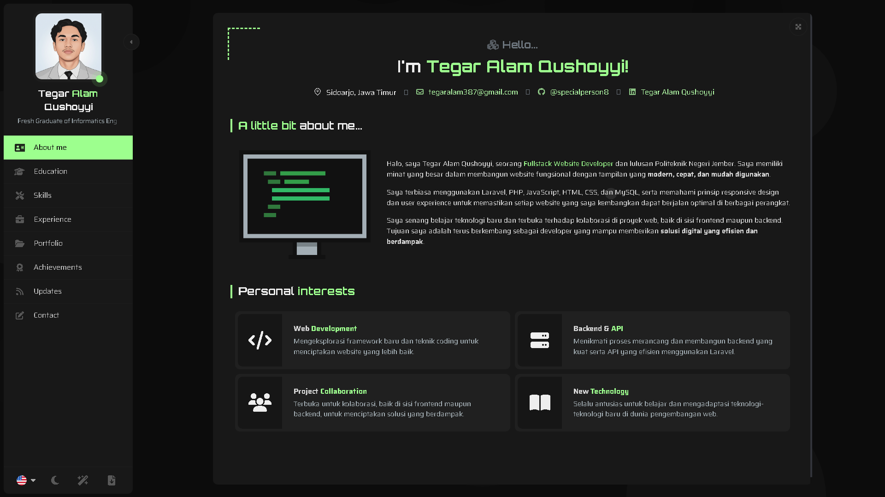

# Portofolio Pribadi - Tegar Alam Qushoyyi

[](https://<NAMA-PROYEK-ANDA>.vercel.app/)
[](https://opensource.org/licenses/MIT)

Sebuah portofolio pribadi yang modern dan futuristik untuk menampilkan perjalanan karier, proyek, dan keahlian saya sebagai seorang Fullstack Web Developer. Dibangun menggunakan **React** dan disesuaikan dari template buatan Ryan Balieiro.



*(**Catatan untuk Anda:** Ganti gambar di atas jika Anda ingin menampilkan screenshot portofolio Anda sendiri).*

### ✨ [Lihat Versi Live di Sini!](https://<NAMA-PROYEK-ANDA>.vercel.app/)

---

## 🚀 Fitur Utama

- **Desain Modern & Responsif:** Tampilan yang elegan dan beradaptasi dengan baik di berbagai ukuran layar, dari desktop hingga mobile.
- **Data Terpusat:** Konten website dikelola melalui file-file JSON, memudahkan pembaruan tanpa menyentuh kode logika.
- **Dukungan Multi-bahasa:** Mendukung Bahasa Inggris dan Bahasa Indonesia.
- **Tema Terang & Gelap:** Opsi untuk mengganti tema sesuai preferensi pengguna.
- **Komponen Lengkap:** Menampilkan pengalaman kerja, pendidikan, keahlian, portofolio, dan pencapaian secara interaktif.
- **Formulir Kontak Fungsional:** Terintegrasi dengan **EmailJS** untuk pengiriman pesan langsung tanpa memerlukan backend.
- **Dibangun dengan Vite:** Menggunakan build tool modern untuk performa pengembangan yang cepat.

---

## 🛠️ Teknologi yang Digunakan

- **React:** Library JavaScript untuk membangun anturaka pengguna.
- **Vite:** Build tool modern untuk pengembangan frontend.
- **Bootstrap 5:** Framework CSS untuk layout dan komponen.
- **Sass:** Preprocessor CSS untuk styling yang lebih terstruktur.
- **EmailJS:** Layanan untuk mengirim email langsung dari sisi klien (client-side).
- **Swiper:** Library untuk membuat slider interaktif.
- **Font Awesome & PrimeIcons:** Untuk ikonografi.

---

## ⚙️ Menjalankan Proyek Secara Lokal

1.  **Clone Repositori**
    ```bash
    git clone https://github.com/<USERNAME_GITHUB_ANDA>/<NAMA_REPO_ANDA>.git
    ```

2.  **Masuk ke Direktori Proyek**
    ```bash
    cd <NAMA_REPO_ANDA>
    ```

3.  **Install Dependensi**
    ```bash
    npm install
    ```

4.  **Jalankan Aplikasi dalam Mode Development**
    ```bash
    npm run dev
    ```
    Buka [http://localhost:5173](http://localhost:5173) (atau port lain yang ditampilkan di terminal) untuk melihat hasilnya.

---

## 🙏 Ucapan Terima Kasih

Portofolio ini dibangun berdasarkan template luar biasa yang dibuat oleh **[Ryan Balieiro](https://ryanbalieiro.com/)**. Terima kasih telah menyediakan template yang terstruktur dengan baik, modern, dan mudah untuk dikustomisasi.

- **[Link ke Repositori Template Asli](https://github.com/ryanbalieiro/react-portfolio-template)**

---

Jika Anda menyukai hasil akhir portofolio ini, jangan ragu untuk memberikan bintang ⭐ pada repositori ini!```